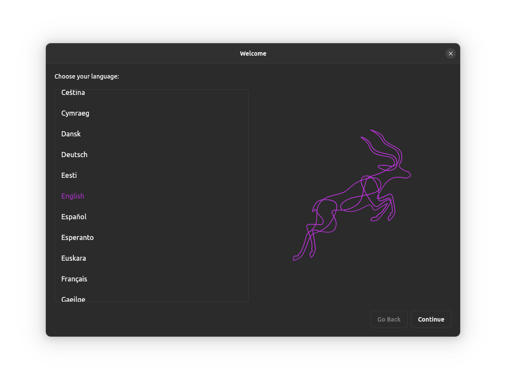

# Ubuntu Flavor Installer

[Ubuntu Desktop Installer](https://github.com/canonical/ubuntu-desktop-installer)
starting point for Ubuntu flavors.

| Light | Dark |
|---|---|
|  |  |

## Getting started

1. Init submodules:
    ```sh
    git submodule update --init --recursive
    ```

2. Install Subiquity's dependencies:
    ```sh
    make -C packages/subiquity_client/subiquity install_deps
    ```

3. [Install Flutter](https://docs.flutter.dev/get-started/install/linux)

4. Run the installer:
    ```
    flutter pub get
    flutter run -d linux
    ```

## Look and feel

The desktop installer has an entry point that allows passing in the name of the flavor displayed throughout the installation wizard, the desired flavor-specific theme, and the flavor’s own installation slides together with delegates for localization.

```dart
import 'package:ubuntu_desktop_installer/installer.dart';
import 'package:flutter_gen/gen_l10n/app_localizations.dart';
import 'package:yaru/yaru.dart';

import 'slides.dart';

Future<void> main(List<String> args) {
  return runInstallerApp(
    args,
    flavor: FlavorData(
      name: 'Ubuntu FLAVOR',
      theme: yaruMagentaLight,
      darkTheme: yaruMagentaDark,
      localizationsDelegates: AppLocalizations.localizationsDelegates,
    ),
    slides: [
      firstSlide,
      secondSlide,
      thirdSlide,
    ],
  );
}
```

`FlavorData.theme` and and `FlavorData.darkTheme` are [ThemeData](https://api.flutter.dev/flutter/material/ThemeData-class.html) instances assigned as [MaterialApp.theme](https://api.flutter.dev/flutter/material/MaterialApp/theme.html) and [MaterialApp.darkTheme](https://api.flutter.dev/flutter/material/MaterialApp/darkTheme.html), respectively. Flutter chooses the appropriate theme based on the [platform brightness](https://api.flutter.dev/flutter/widgets/MediaQueryData/platformBrightness.html). Even though the light and dark theme can be any Flutter themes, it is highly recommended to use one of the [Yaru themes](https://pub.dev/documentation/yaru/latest/yaru/yaru-library.html#properties) that include ready-made variants for many flavors. This ensures good compatibility with the [Yaru widgets](https://pub.dev/packages/yaru_widgets) used throughout the installer. Notice that it's also possible to partially customize the ready-made themes should a need for that arise:

```dart
theme: yaruFooLight.copyWith(
  inputDecorationTheme: InputDecorationTheme(
    // ...
  ),
),
```

## Image assets

Images such as logos and theme previews can be customized by overriding assets used in the desktop installer by creating assets by the same name in the flavor installer. Whenever the desktop installer shows images, it looks up the application (flavor) assets first and if not found, falls back to the one in `ubuntu_desktop_installer`. Therefore, a flavor can freely choose to override a subset or all images.

The installer organizes its image assets by following such convention that aims to make it easy to understand where each image asset it used: `assets/<page>/<image>`. This template has overridden many of the original image assets with purple variants. A few examples:

```
ubuntu-flavor-installer/
└── assets
    ├── choose_your_look
    │   ├── dark-theme.png
    │   └── light-theme.png
    ├── installation_complete
    │   └── logo.png
    └── welcome
        └── logo.svg
```

The full set of image assets is visible at [ubuntu-desktop-installer/assets](https://github.com/canonical/ubuntu-desktop-installer/tree/main/packages/ubuntu_desktop_installer/assets).
